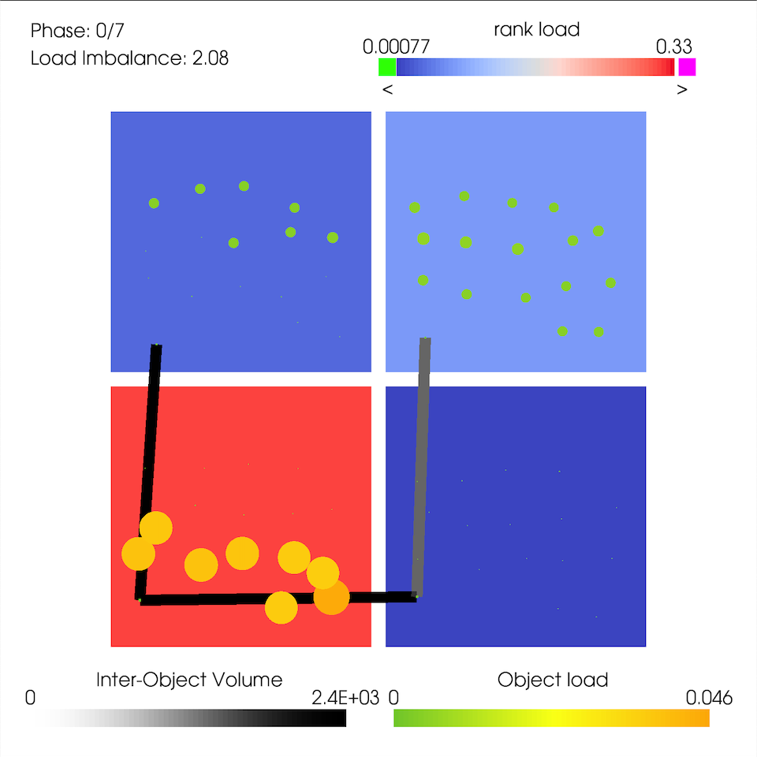

[](https://github.com/DARMA-tasking/vt-tv/actions/workflows/build-and-test-vt-tv.yml)

# tv => task visualizer

The task visualizer takes as input JSON files that describe work as a
series of phases and subphases that contain tasks for each rank,
communications, and other user-defined fields (such as memory
usage). Documentation on the JSON format can be found [in vt's
documentation](https://darma-tasking.github.io/docs/html/node-lb-data.html)
and the JSON schema validator is located [in the
repository](https://github.com/DARMA-tasking/vt/blob/develop/scripts/JSON_data_files_validator.py).

The task visualizer, using this input, produces Exodus meshes to
describe the ranks and objects over time, which can be visualized
using Paraview. Additionally, the task visualizer can produce PNGs
directly using a VTK workflow to render a visualization of ranks and
tasks over phases.



## Building the Python bindings

###Requirements

In order to build the python bindings, make sure you have a Python <ins>`3.8` or `3.9`</ins> environment, with the `nanobind` package installed. You can install `nanobind` with `pip`:

```bash
pip install nanobind
```

You must have a C++ compiler that supports C++17, and `cmake` >= 3.17.

Finally, you must have a (<ins>C++</ins>) [VTK](https://vtk.org/) build available on your system. We recommend building from source, and the currently tested version is `9.3.0`. You can find instructions for building VTK [here](https://gitlab.kitware.com/vtk/vtk/-/blob/master/Documentation/docs/build_instructions/build.md).

### Building

To build the python bindings, you must specify in the `VTTV_VTK_DIR` environment variable the path to the VTK build directory:

```bash
export VTTV_VTK_DIR=/path/to/vtk/build
```


Then, to install python-environment-wide the binded `vt-tv` python module, run:

```bash
pip install .
```
**Optional**

To specify the number of parallel jobs to use during the build, you can set the `VTTV_J` environment variable:

```bash
export VTTV_J=8
```

> [!NOTE]
> Behind the scenes, the usual `cmake` and `make` commands are run. Depending on your system, this can cause the install process to be lengthy as it will be compiling the entire `vt-tv` library.
